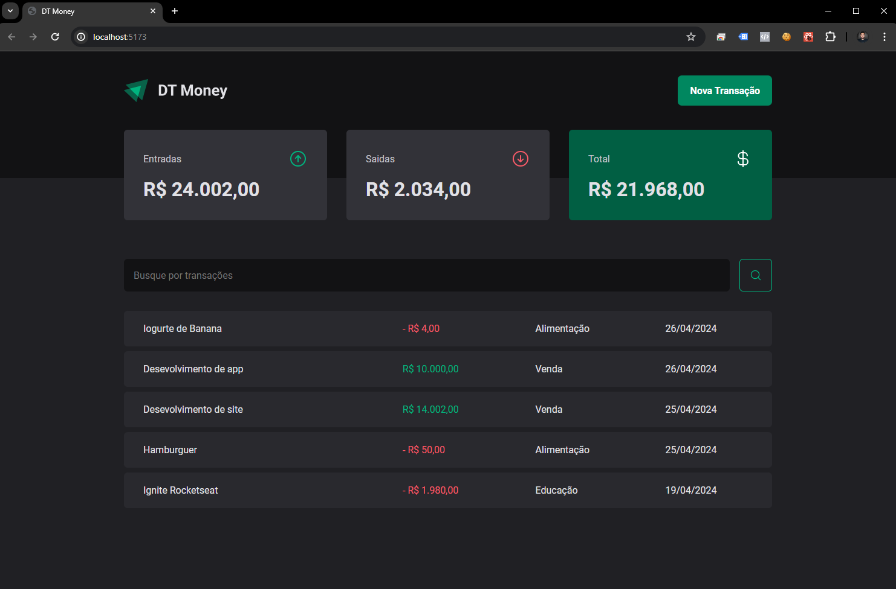
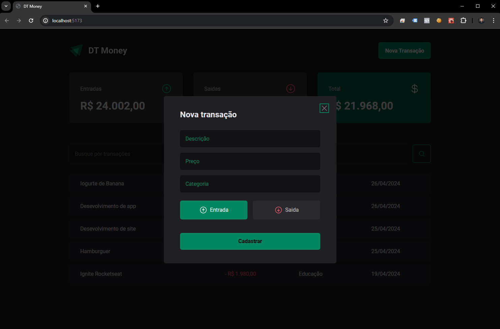

# Dt Money

Dt Money é uma aplicação de gerenciamento financeiro que permite aos usuários acompanhar suas transações.

## Funcionalidades

- **Visualização de Transações**: Visualize suas transações em uma tabela com descrição, preço, categoria e data.
- **Resumo Financeiro**: Veja um resumo das suas transações, incluindo entradas, saídas e saldo total.
- **Busca de Transações**: Busque por transações específicas utilizando o campo de busca.

## Capturas de Tela





## Instalação

1. Clone o repositório
   ```sh
   git clone https://github.com/caiosantosxp/dt-money

2. Instale os pacotes NPM
   ```sh
   npm install

3. Execute o aplicativo
   ```sh
   npm run dev


## Tecnologias Utilizadas

- React
- TypeScript
- Styled Components
- Axios
- React Hook Form
- Zod
- Radix UI
- Phosphor Icons
- useContextSelector

## Autor

Feito por Caio Santos

## Licença

Este projeto está sob a Licença Rocketseat 
# dt-money
